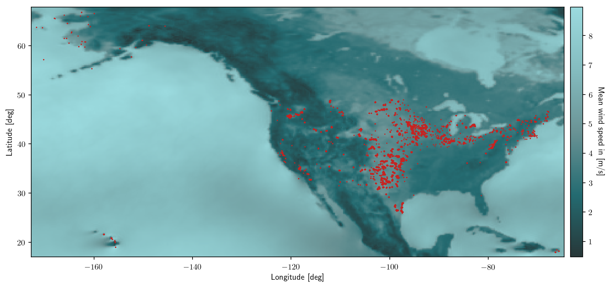

The potential for repowering US wind turbines
=============================================

This repository contains code to produce the figures for an analysis first
presented at the [EGU 2019](https://www.egu2019.eu/) in the session
[Spatiotemporal modelling of distributed renewable energy systems](https://meetingorganizer.copernicus.org/EGU2019/orals/30279)
([abstract](https://meetingorganizer.copernicus.org/EGU2019/EGU2019-7252.pdf)).

* [slides](doc/slides/slides.pdf)
* [abstract](doc/abstract/abstract.pdf)
* [figures](figures)

For more information about the project visit https://refuel.world/.




Requirements
------------

* dependencies: see [env.yml](env.yml) + standard tools like GNU Make, wget
* approx. 200GB of disk space, more than 16GB RAM
* API key for the [CDS API](https://cds.climate.copernicus.eu/api-how-to)
* API key for the [EIA API](https://www.eia.gov/developer/)


How to run
----------

To install all dependencies using conda:

```
conda env update -f env.yml
```

Store the [EIA API key](https://www.eia.gov/developer/) in a plain text file
`eia-api-key` in the repository root directory.

Run individual steps using [Make](https://www.gnu.org/software/make/):

```
make download_turbines
make download_wind_era5
make download_energy_generation
make calc_wind_speed
make calc_simulated_energy_timeseries
make calc_simulated_energy_per_location
make calc_optimal_locations
make calc_repower_potential
make calc_min_distances
make generate_figures
make slides
```


Changelog
---------

* [egu2019](https://github.com/inwe-boku/wind-repowering-usa/tree/egu2019): version presented at the [EGU 2019](http://egu2019.eu/)
